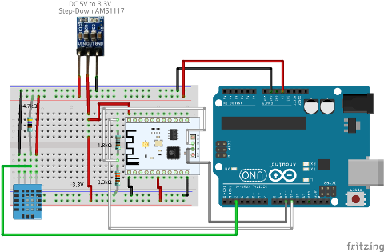
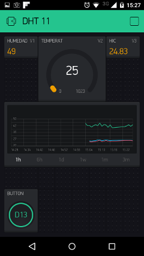

# ESP-201 + Kickstarter Blynk + DHT11 + LED

Experimento simple para evaluar el kickstarter  [BLYNK](http://www.blynk.cc/)

## Preparación del Hardware

Realizar la instalación de las componentes siguiendo el siguiente diagrama:



En las pruebas el ESP-201 está con el firmarwe AT V0.50

## Preparación en la IDE de Arduino

1. Descargar el último release de la librería BLYNK desde [github](https://github.com/blynkkk/blynk-library/releases)
2. Descomprimir las librerías descargadas y copiarlas al directorio Arduino/libraries (o similar) de su instalación de arduino
3. Editar el archivo BlynkESP8266_SoftSer/ESP8266_SoftSer.h especificando la versión del firmware AT que esté instalada en el ESP-201
    ```
    #define  USER_SEL_VERSION         VERSION_22
    ```
	La versión v.050 no aparece en el archivo, por lo cual he especificado VERSION_22
4. Editar el sketch de más arriba especificando los datos de su wifi y el Auth Token de la Aplicación que se señala más adelante.

## Preparación en el celular

La instalación de la aplicación BLYNK en el celular es muy simple, sólo instalar como cualquier otra aplicación desde el market.

Crear un proyecto como el que se muestra en la siguiente imagen (se están utilizando los pines virtuales V1, V2 y V3, y el pin digital D13):



Recordar copiar el Auth Token en el sketch arduino


## Resultados

Interesante aplicación tanto en la IDE como en el celular. Problemas que he detectado:

1. La IDE de arduino rapidamente reporta falta de memoria para el sketch
2. Blynk es inestable. Errores constantes de buffer overflow (arduino) y de desconexión (celular) impiden avanzar con elementos más sofisticados.

