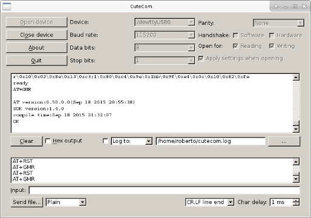

# ESP-01: Firmare AT

Recordar que el ESP8266 opera con 3.3V y conectar algún pin a 5V "podría" dañarlo.
## Conexiones ##

Conectar los pines del ESP-01 de la siguiente manera:

* VCC -> 3.3V
* CHP_PD -> 3.3V
* GND -> GND de la fuente externa
* GPIO0 -> GND  (sólo en modo flash de firmware)

Al conectar el ESP-01 a un arduino o a un adaptador serial USB a TTL considere lo siguiente:

* Conecte GND del arduino o del adaptador USB a TTL a GND del ESP-01
* No alimente el ESP-01 con la línea 3.3V del arduino o del adaptador USB a TTL dado que no suministran suficiente corriente
* Conecte RX del arduino o del adaptador USB a TTL a TX del ESP-01.
* Conecte TX del arduino o del adaptador USB a TTL  (si no es 3.3V) a RX del ESP-01 a través de un divisor de voltaje:


Para simplificar todo, preparé una mini breadboard con las conexiones requeridas y la puse sobre un shield de prototipado tal como se observa en la siguiente imagen:


La alimentación la tomo desde los 5V del arduino y la llevo a 3.3V con un step down power.

## Instalar Firmarware AT de Espressif##

1. Descargar **esptool** desde [github.com/themadinventor](https://github.com/themadinventor/esptool/). Este programa nos permitirá grabar el firmware en el ESP-01

2. Descargar el firmware AT desde el sitio de Espressif. En mi caso estoy utilizando la versión [AT_v0.50_on_esp_iot_sdk_v1.4.0_150918](http://bbs.espressif.com/viewtopic.php?f=46&t=1123). La documentación puede ser encontrada [aquí](http://bbs.espressif.com/viewtopic.php?f=51&t=1022)

3. Preparar un script para enviar las partes del firmware al ESP-01
```
~/bin/esptool.py -p /dev/ttyUSB0 -b 230400 write_flash  \
0x000000 "at/boot_v1.4(b1).bin" \
0x001000 "at/512+512//user1.1024.new.2.bin" \
0x3fc000 "at/esp_init_data_default.bin" \
0x07e000 "at/blank.bin" \
0x3fe000 "at/blank.bin" \
-fs 32m -fm dio -ff 40m
```
Asumimos que el adaptador USB a TTL está en ttyUSB0 y que soporta una velocidad de 230400. El parámetro `-fs 32m` se utiliza para indicar el tamaño de la memoria (4Mb).

5. Conecte el adaptador USB a TTL al ESP-01

4. Colocar el dispositivo en modo Flash conectando a GND el pin GPIO0

5. Encienda el ESP-01

6. Ejecute el script que creó en el punto 3


7. Al finalizar el flasheo apague el ESP-01 y desconecte el pin GPIO0.


## Ajuste final y pruebas

1. Conéctese al adaptador USB a TTL desde un software de terminal (CuteCom) a 115200,8, N, 1 que es la configuración de la versión del firmware AT que hemos flasheado.

2. Encienda el ESP-01. Se desplegará "basura" y en la última línea aparecerá el mensaje "ready". Escriba los siguientes comandos utilizando `\r\n` como delimitadores de línea
```
AT+RST
AT+GMR
```


3. Finalmente decidimos trabajar a 9600 por cuanto dicha velocidad opera razonablemente bien en arduino con la librería SoftwareSerial. Para esto enviamos el comando
```
AT+UART_DEF=9600,8,1,0,0
```
La nueva velocidad queda configurada desde el instante en que ingrese el comando, por lo que deberá cerrar la sesión del terminal y configurar la nueva velocidad.


