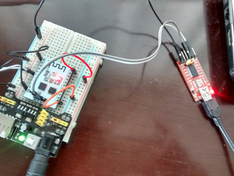

# ESP-201: Firmare AT en módulo con 512KB (4Mb)

Recordar que el ESP8266 opera con 3.3V y conectar algún pin a 5V "podría" dañarlo.
## Conexiones ##

De fábrica el ESP-201 trae los pines (3.3V, RX, TX, GND) centrales hacia abajo, dificultando su uso en una protoboard. En mi caso los invertí para manipularlos de mejor manera (quedaron hacia arriba).


Conectar los pines del ESP-201 de la siguiente manera:

* GPIO0 -> GND  (sólo en modo flash de firmware)
* 3.3V -> 3.3V de una fuente externa
* GPIO15 -> GND de la fuente externa (permanente)
* CHP_EN/CHP_PD -> 3.3V (permanente)
* GND -> GND de la fuente externa

Al conectar el ESP-201 a un arduino o a un adaptador serial USB aTTL considere lo siguiente:

* Conecte GND del arduino o del adaptador USB a TTL a GND del ESP-201
* No alimente el ESP-201 con la línea 3.3V del arduino o del adaptador USB a TTL dado que no suministran suficiente corriente
* Conecte RX del arduino o del adaptador USB a TTL a TX del ESP-201.
* Conecte TX del arduino o del adaptador USB a TTL  (si no es 3.3V) a RX del ESP-201 a través de un divisor de voltaje:


## Instalar Firmarware AT de Espressif##

1. Descargar **esptool** desde [github.com/themadinventor](https://github.com/themadinventor/esptool/). Este programa nos permitirá grabar el firmware en el ESP-201

2. Descargar el firmware AT desde el sitio de Espressif. En mi caso estoy utilizando la versión [AT_v0.50_on_esp_iot_sdk_v1.4.0_150918](http://bbs.espressif.com/viewtopic.php?f=46&t=1123). La documentación puede ser encontrada [aquí](http://bbs.espressif.com/viewtopic.php?f=51&t=1022)

3. Preparar un script para enviar las partes del firmware al ESP-201
```
~/bin/esptool.py -p /dev/ttyUSB0 -b 230400 write_flash  \
0x7e000 "at/blank.bin" \
0x7c000 "at/esp_init_data_default.bin" \
0x40000 "at/noboot/eagle.irom0text.bin" \
0x3e000 "at/blank.bin" \
0x00000 "at/noboot/eagle.flash.bin" \
-fs 4m -fm dio -ff 40m
```
Asumimos que el adaptador USB a TTL está en ttyUSB0 y que soporta una velocidad de 230400. La documentación señala que se deben utilizar las partes del directorio `noboot`. El parámetro `-fs 4m` se utiliza para indicar el tamaño de la memoria (4Mb). El orden de las partes es fundamental; por algún motivo el firmware no queda bien si es que no se sigue el orden presentado.

5. Conecte el adaptador USB a TTL al ESP-201

4. Colocar el dispositivo en modo Flash conectando a GND el pin GPIO0


5. Encienda el ESP-201

6. Ejecute el script que creó en el punto 3


7. Al finalizar el flasheo apague el ESP-201 y desconecte el pin GPIO0.


## Ajuste final y pruebas

1. Conéctese al adaptador USB a TTL desde un software de terminal (CuteCom) a 115200,8, N, 1 que es la configuración de la versión del firmware AT que hemos flasheado.

2. Encienda el ESP-201. Se desplegará "basura" y en la última línea aparecerá el mensaje "ready". Escriba los siguientes comandos utilizando `\r\n` como delimitadores de línea
```
AT+RST
AT+GMR
```


3. Finalmente decidimos trabajar a 9600 por cuanto dicha velocidad opera razonablemente bien en arduino con la librería SoftwareSerial. Para esto enviamos el comando
```
AT+UART_DEF=9600,8,1,0,0
```
La nueva velocidad queda confgurada desde el instante en que ingrese el comando, por lo que deberá cerrar la sesión del terminal y configurar la nueva velocidad.


