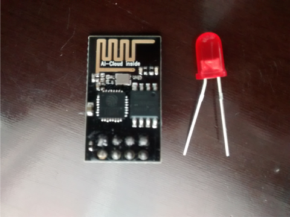
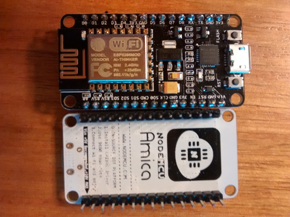
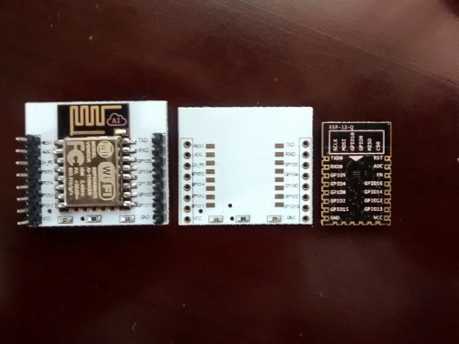

# ESP8266
Experimentos con ESP8266 en Linux

## ESP-201 ##

ESP8266 con 512KB (4Mb):
* [Firmware AT](./ESP201_AT.md)
* [Enviar datos a ThingSpeak con Arduino + ESP8266](./ThingSpeak)
* [ESP-201 + Kickstarter Blynk + DHT11 + LED](./Blynk)
* Firmware NodeMCU

## ESP-01 ##

ESP8266 con 4096KB (32Mb):
* [Firmware AT](./ESP01_AT.md)

## NodeMCU DevKit de Amica ##

* Firmware AT
* Firmware NodeMCU

## ESP12-E ##

