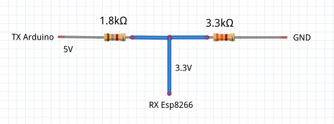

# ESP8288
Enviar datos a ThingSpeak con Arduino + ESP8266 (ESP-201)

## Conexiones ##
* Conecte GND del arduino a GND del ESP-201
* No alimente el ESP-201 con la línea 3.3V del arduino dado que no suministra suficiente corriente
* Conecte el pin RX del arduino (10) al pin TX del ESP-201.
* Conecte el pin TX del arduino (11) al pin RX del ESP-201 a través de un divisor de voltaje. En particular, utilizo un LED en lugar de una resistencia de 10K obteniendo los mismos resultados:

## Código ##

1. En la IDE de arduino cargue el archivo ThingSpeak.ino y modifique las primeras líneas acorde a su configuración, así como el código en la funcón `loop()`

2. Compile y envíe al arduino el sketch.

3. Utilice el monitor de la IDE para ver el progreso

4. Acceda al canal de ThingSpeak para ver como se actualizan los parámetros

